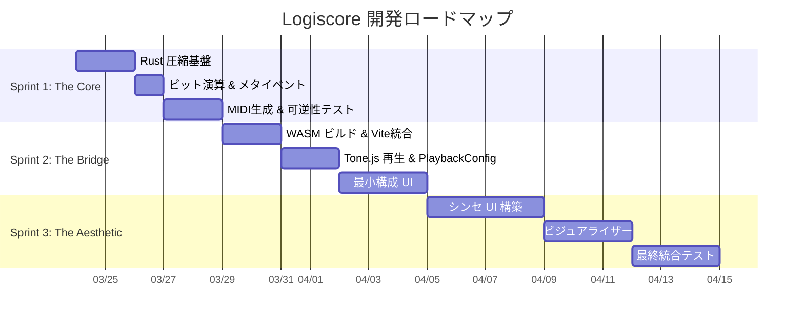
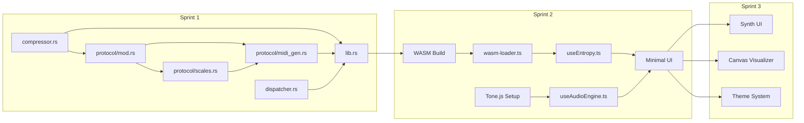

# Logiscore — 開発ロードマップ

> **作成日:** 2026-03-23
> **最終更新:** 2026-03-23
> **方針:** アジャイル開発（1スプリント = 4〜10日）
> **原則:** 各スプリント終了時に動作する成果物を必ず1つ以上デモできる状態にする

---

## マイルストーン概観



---

## Sprint 1: "The Core"（4–5日）

> **ゴール:** CLIで `cargo test` を実行し、1000行のコードがMIDI経由で100%復元される

### タスク一覧

| # | タスク | 優先度 | 完了条件 |
|---|--------|--------|----------|
| 1.1 | `cargo new packages/harmonic-core --lib` でプロジェクト作成 | 🔴 必須 | Cargo.toml に flate2, midly, thiserror を追加 |
| 1.2 | `compressor.rs`: zlib 圧縮/展開 (level 6) | 🔴 必須 | 任意文字列で `decompress(compress(x)) == x` |
| 1.3 | `protocol/mod.rs`: `Header`, `HarmonicByte` 構造体 | 🔴 必須 | 全256値 (0x00–0xFF) で `from_byte(to_byte(x)) == x` |
| 1.4 | `protocol/scales.rs`: 5つの音階テーブル + 一意性検証 | 🔴 必須 | コンパイル時に一意性を静的検証 |
| 1.5 | `dispatcher.rs`: 拡張子 → Header マッピング | 🟡 推奨 | `.rs` → Industrial/C 等の正しい対応 |
| 1.6 | `protocol/midi_gen.rs`: メタイベント付き MIDI 生成 | 🔴 必須 | `LOGISCORE:v1`, `SCALE`, `ROOT`, `LEN` をメタイベントで格納 |
| 1.7 | `protocol/midi_gen.rs`: メタイベント解析 & バイト復元 | 🔴 必須 | `LEN` ベースでパディング除去、全バイト復元 |
| 1.8 | `lib.rs`: `encode` / `decode` 統合関数 | 🔴 必須 | 文字列 → MIDI → 文字列 の完全一致 |
| 1.9 | 統合テスト: 1000行の Rust ソースで可逆性テスト | 🔴 必須 | `assert_eq!(original, decoded)` |
| 1.10 | エッジケーステスト: 空文字列、1文字、`0xN0` バイト群 | 🔴 必須 | 全ケースで可逆性保持 & panic なし |
| 1.11 | プロパティベーステスト (proptest) | 🟡 推奨 | ランダム入力で可逆性を検証 |

### Sprint 1 完了基準（DoD）

```bash
$ cargo test
running 12 tests
...
test result: ok. 12 passed; 0 failed

$ cargo clippy
# 警告 0 件
```

### 技術的注意事項

> [!IMPORTANT]
> **「音」の品質は Sprint 1 では評価しない。** diff が0であることのみを追求すること。
> 美しさは Sprint 3 の責務。

> [!IMPORTANT]
> **Velocity = 0 は正規データ。** `0x10`, `0x20` 等のバイトがパディングとして無視されないことをテストで必ず検証すること。

---

## Sprint 2: "The Bridge"（5–7日）

> **ゴール:** ブラウザでコードを貼り付け、PLAY を押すと音が鳴り、完了後にコードが復元される最小構成

### タスク一覧

| # | タスク | 優先度 | 完了条件 |
|---|--------|--------|----------|
| 2.1 | `wasm-pack build` で WASM ビルドパイプライン構築 | 🔴 必須 | `pkg/` に `.wasm` + `.js` グルーコード生成 |
| 2.2 | Vite + React プロジェクト作成 (`apps/web/`) | 🔴 必須 | `npm run dev` で起動確認 |
| 2.3 | `vite-plugin-wasm` 設定 & WASM ローダー実装 | 🔴 必須 | `init()` 後に `encode()` / `decode()` が呼べる |
| 2.4 | `useEntropy.ts`: WASM 呼び出しフック | 🔴 必須 | React コンポーネントから利用可能 |
| 2.5 | Tone.js セットアップ & MIDI 再生 | 🔴 必須 | コンソールで音が鳴ることを確認 |
| 2.6 | `useAudioEngine.ts`: PlaybackConfig 対応 | 🔴 必須 | `noteDuration`, `tickInterval` で再生品質制御 |
| 2.7 | 最小 UI: テキストエリア + PLAY ボタン + 出力エリア | 🔴 必須 | E2E で動作確認 |
| 2.8 | エンコード → 再生 → デコード の一気通貫フロー | 🔴 必須 | 入力 === 出力 |

### Sprint 2 完了基準（DoD）

1. ブラウザで `localhost:5173` を開く
2. テキストエリアに任意のコードを貼り付ける
3. PLAY ボタンを押す → 音が鳴る（音階が知覚できる発音時間）
4. 再生完了後、出力エリアに元のコードが表示される
5. 入力と出力が `===` で一致する

### 技術的注意事項

> [!WARNING]
> **WASM のメモリ管理に注意。** `Uint8Array` のコピーコストを最小化するため、
> JS 側で不要なコピーを避け、WASM のリニアメモリを直接参照すること。

> [!TIP]
> Tone.js の `AudioContext` はユーザーインタラクション（クリック）後にのみ開始可能。
> PLAY ボタンの `onClick` ハンドラ内で `Tone.start()` を呼ぶこと。

> [!TIP]
> Vite は WASM の動的インポートをネイティブサポートしている。
> `vite-plugin-wasm` + `vite-plugin-top-level-await` で設定がシンプルになる。

---

## Sprint 3: "The Aesthetic"（7–10日）

> **ゴール:** 本物のシンセサイザーのような質感を持つ UI で、言語ごとに異なる音色と視覚演出を実現

### タスク一覧

| # | タスク | 優先度 | 完了条件 |
|---|--------|--------|----------|
| 3.1 | デザインシステム構築（カラーパレット、タイポグラフィ） | 🔴 必須 | Tailwind テーマ設定完了 |
| 3.2 | `Deck/Knob.tsx`: ロータリーノブ（Root Key 選択） | 🔴 必須 | ドラッグで値変更、触覚フィードバック |
| 3.3 | `Deck/Switch.tsx`: トグルスイッチ（Scale 切替） | 🔴 必須 | クリックで切替、物理シミュレーション |
| 3.4 | `Deck/Display.tsx`: LCD ディスプレイ | 🟡 推奨 | 現在の状態（Scale/Root/進捗）表示 |
| 3.5 | `Editor/CodeEditor.tsx`: Monaco Editor 統合 | 🔴 必須 | シンタックスハイライト、拡張子自動検出 |
| 3.6 | 拡張子ごとの背景色・テーマ切替 | 🟡 推奨 | `.rs` → ダークオレンジ等 |
| 3.7 | `Visualizer/WaveView.tsx`: Canvas 2D 波形/ノート可視化 | 🟡 推奨 | 再生中リアルタイム描画 |
| 3.8 | コードハイライト連動: 再生中の対応行が光る | 🟢 Nice-to-have | Monaco デコレーションAPI |
| 3.9 | チャンネルごとの楽器（音色）切替 | 🟡 推奨 | Tone.js Sampler でピアノ/シンセ/パーカス |
| 3.10 | テンポノブ（PlaybackConfig.tickInterval 制御） | 🟡 推奨 | 50ms–500ms の範囲で調整可能 |
| 3.11 | レスポンシブ対応 | 🟡 推奨 | モバイルでも基本操作可能 |
| 3.12 | 最終統合テスト & パフォーマンス計測 | 🔴 必須 | 全 KPI をクリア |

### Sprint 3 完了基準（DoD）

1. **視覚:** 「本物のシンセだ」と直感的に感じるUIクオリティ
2. **音楽:** 拡張子ごとに異なる音階・音色で演奏される
3. **可逆性:** 依然として 100% のデータ復元率
4. **性能:** 100KB のコードを 1 秒以内にエンコード

### UI デザイン参考

```
┌─────────────────────────────────────────────────┐
│  L O G I S C O R E                    [≡] [×]  │
├─────────────────────────────────────────────────┤
│ ┌─────────────────┐  ┌─────────────────────┐   │
│ │   Monaco Editor │  │   ╭──╮  ╭──╮  ╭──╮  │   │
│ │                 │  │   │🎛│  │🎛│  │🎛│  │   │
│ │  fn main() {    │  │   ╰──╯  ╰──╯  ╰──╯  │   │
│ │    println!()   │  │  Root  Scale  Tempo  │   │
│ │  }              │  │                       │   │
│ │                 │  │  ┌─────────────────┐  │   │
│ │                 │  │  │  LCD Display    │  │   │
│ │                 │  │  │  .rs | C Ind    │  │   │
│ │                 │  │  └─────────────────┘  │   │
│ │                 │  │                       │   │
│ │                 │  │  [▶ PLAY]  [⏹ STOP]  │   │
│ └─────────────────┘  └─────────────────────┘   │
│ ┌───────────────────────────────────────────┐   │
│ │  ▁▂▃▅▆▇█▇▆▅▃▂▁  Visualizer              │   │
│ └───────────────────────────────────────────┘   │
└─────────────────────────────────────────────────┘
```

---

## Sprint 4+: 将来の拡張（バックログ）

> Sprint 1–3 完了後に着手を検討する機能群

| # | 機能 | 説明 | 優先度 |
|---|------|------|--------|
| 4.1 | MIDI ファイルダウンロード | 生成した MIDI を `.mid` として保存 | 🟡 |
| 4.2 | MIDI ファイルアップロード & デコード | 外部 MIDI を読み込みコード復元 | 🟡 |
| 4.3 | 複数ファイル対応 | プロジェクト全体を1つの「楽曲」に | 🟢 |
| 4.4 | カスタム音階エディタ | ユーザーが独自の音階を定義 | 🟢 |
| 4.5 | 共有機能 | 生成した MIDI を URL で共有 | 🟢 |
| 4.6 | DAW 連携 | Velocity 非依存エンコードへの設計変更が前提 | 🔵 |
| 4.7 | バイナリファイル対応 | UTF-8 以外のファイルに対応 | 🟡 |
| 4.8 | リアルタイムコラボ | 複数人でコード入力→同時演奏 | 🔵 |

---

## 依存関係マトリクス



---

## 品質ゲート

各スプリント終了時に以下を満たすこと:

| チェック項目 | Sprint 1 | Sprint 2 | Sprint 3 |
|-------------|----------|----------|----------|
| `cargo test` 全パス | ✅ | ✅ | ✅ |
| `cargo clippy` 警告0 | ✅ | ✅ | ✅ |
| `cargo audit` 脆弱性0 | ✅ | ✅ | ✅ |
| `npm audit` 脆弱性0 | — | ✅ | ✅ |
| 可逆性 100% (Vel=0含む) | ✅ | ✅ | ✅ |
| Lighthouse Performance ≥ 90 | — | — | ✅ |
| E2E テスト全パス | — | ✅ | ✅ |

---

## リリース判定基準

**v1.0.0 リリースの条件:**

1. ✅ Sprint 1–3 の全 DoD を達成
2. ✅ 品質ゲートの全項目をクリア
3. ✅ README.md にプロジェクト概要・使い方・デモ GIF を記載
4. ✅ GitHub にパブリックリポジトリとして公開
5. ✅ デモサイトを Vercel にデプロイ
