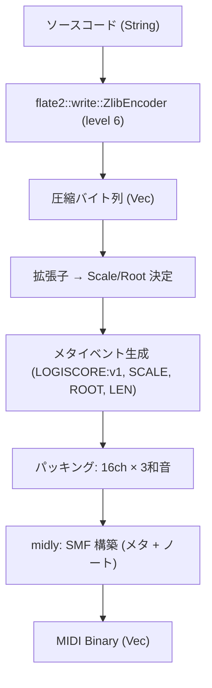
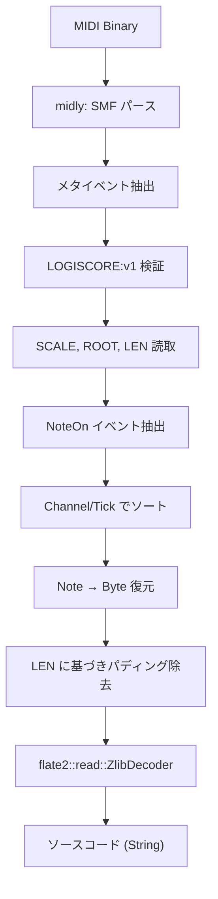

# Logiscore — 技術仕様書

> **バージョン:** 1.1.0
> **作成日:** 2026-03-23
> **最終更新:** 2026-03-23
> **ステータス:** Approved

---

## 1. プロトコル定義（Harmonic Byte Protocol v1.1）

> [!CAUTION]
> 本プロトコルのビット演算ルールは **可逆性の担保** のため、一切変更してはならない。
> 変更する場合はバージョン番号を上げ、後方互換性を維持すること。

### 1.1 MIDI メタイベント・ヘッダー

エンコード情報は**MIDIメタイベント（テキストイベント）** としてトラック冒頭に格納する。
データストリーム（NoteOn/NoteOff）にはヘッダーを**一切混入させない**。

```
Track 冒頭のメタイベント群:
┌─────────────────────────────────────────────┐
│ Text Event: "LOGISCORE:v1"   ← マジックナンバー │
│ Text Event: "SCALE:2"        ← Scale ID      │
│ Text Event: "ROOT:0"         ← Root Key      │
│ Text Event: "LEN:12345"      ← 有効データ長    │
└─────────────────────────────────────────────┘
その後に NoteOn/NoteOff イベントが続く
```

| メタイベント | 形式 | 説明 |
|-------------|------|------|
| `LOGISCORE:v1` | 固定文字列 | Logiscore生成MIDIの識別子。バージョン管理に使用 |
| `SCALE:<id>` | `id`: 0–15 | 使用する音階のインデックス |
| `ROOT:<key>` | `key`: 0–11 | 基準音（C=0, C#=1, ..., B=11） |
| `LEN:<n>` | `n`: 正の整数 | 圧縮データの有効バイト数 |

#### Scale ID 一覧

| ID | 名称 | 用途 | 音楽的特徴 |
|----|------|------|-----------|
| 0 | Major | 汎用 | 明るく開放的 |
| 1 | Minor | Python, Go | 繊細で内省的 |
| 2 | Industrial | Rust | 無機質で重厚（全音階的）|
| 3 | Future | TypeScript | 浮遊感のあるモーダル |
| 4 | Ambient | JSON, YAML | 静謐で持続的 |
| 5–15 | Reserved | 将来拡張用 | — |

### 1.2 Data Body（NoteOn イベント）

圧縮済みデータの各バイトを **1音 = 1バイト = 8bit** として表現する。

```
Bit:  7  6  5  4  3  2  1  0
     [Pitch Offset] [ Velocity ]
     [   4bit      ] [  4bit   ]
```

| フィールド | ビット位置 | 型 | 範囲 | 説明 |
|-----------|-----------|-----|------|------|
| Pitch Offset | `[7:4]` | i4 (2の補数) | -8 〜 +7 | Root からの相対音階移動 |
| Velocity | `[3:0]` | u4 | 0–15 | 音の強弱インデックス |

> [!IMPORTANT]
> **Velocity = 0 は正規データである。** パディング判定にデータ内容を使用してはならない。
> パディングの除去は `LEN` メタイベントに記録された有効バイト数に基づいて行う。

#### ビット操作の詳細

**エンコード（Byte → Note）:**

```rust
let pitch_offset: i8 = ((byte >> 4) & 0x0F) as i8;  // 上位4bit
let velocity_idx: u8 = byte & 0x0F;                   // 下位4bit

// 2の補数展開（符号付き4bit → i8）
let pitch_offset = if pitch_offset > 7 {
    pitch_offset - 16
} else {
    pitch_offset
};

// MIDI Note Number 算出
let note_number = root_key + scale[((pitch_offset + 8) as usize)];

// MIDI Velocity 算出 (0–127 へスケーリング)
let midi_velocity = (velocity_idx * 8) + 7;
```

**デコード（Note → Byte）:**

```rust
// MIDI Note Number → Pitch Offset 逆算
let relative = note_number - root_key;
let scale_index = scale.iter().position(|&n| n == relative)
    .expect("Invalid note: not in scale");
let pitch_offset = (scale_index as i8) - 8;

// MIDI Velocity → Velocity Index 逆算
let velocity_idx = (midi_velocity - 7) / 8;

// バイト復元
let byte = (((pitch_offset as u8) & 0x0F) << 4) | (velocity_idx & 0x0F);
```

---

## 2. 音階定義（Scale Definitions）

### 2.1 音階テーブル

各音階は **16要素の半音オフセット配列** で定義される。Pitch Offset `-8` ~ `+7` が配列インデックス `0` ~ `15` に対応。

> [!CAUTION]
> **一意性制約:** 各音階配列の16要素はすべて異なる値でなければならない。
> 重複が存在するとデコード時の `position()` が一意なインデックスを返せず、データが破壊される。
> この制約はコンパイル時に静的に検証する。

```rust
/// 音階定義: 各要素は Root Key からの半音数
/// 不変条件: 各配列の全16要素はユニーク & 昇順
pub const SCALES: [[u8; 16]; 5] = [
    // 0: Major Scale (2オクターブ + α)
    [0, 2, 4, 5, 7, 9, 11, 12, 14, 16, 17, 19, 21, 23, 24, 26],

    // 1: Minor Scale (Natural Minor, 2オクターブ + α)
    [0, 2, 3, 5, 7, 8, 10, 12, 14, 15, 17, 19, 20, 22, 24, 26],

    // 2: Industrial Scale (Diminished / 全音階的)
    [0, 1, 3, 4, 6, 7, 9, 10, 12, 13, 15, 16, 18, 19, 21, 22],

    // 3: Future Scale (Lydian Dominant 系)
    [0, 2, 4, 6, 7, 9, 10, 12, 14, 16, 18, 19, 21, 22, 24, 26],

    // 4: Ambient Scale (Pentatonic + Octave layers)
    [0, 2, 4, 7, 9, 12, 14, 16, 19, 21, 24, 26, 28, 31, 33, 36],
];

/// コンパイル時の一意性検証
const fn assert_unique_scale(scale: &[u8; 16]) {
    let mut i = 0;
    while i < 16 {
        let mut j = i + 1;
        while j < 16 {
            assert!(scale[i] != scale[j], "Scale elements must be unique");
            j += 1;
        }
        i += 1;
    }
}

const _: () = {
    let mut i = 0;
    while i < 5 {
        assert_unique_scale(&SCALES[i]);
        i += 1;
    }
};
```

### 2.2 拡張子 → Scale/Root マッピング

| 拡張子 | Scale ID | Root Key | 理由 |
|--------|----------|----------|------|
| `.rs` | 2 (Industrial) | 0 (C) | Rustの堅牢さを無機質な音階で表現 |
| `.py` | 1 (Minor) | 7 (G) | Pythonのエレガントさを短調で |
| `.ts` | 3 (Future) | 2 (D) | TypeScriptの先進性を浮遊感で |
| `.go` | 0 (Major) | 5 (F) | Goのシンプルさを明快な長調で |
| `.json` | 4 (Ambient) | 9 (A) | データファイルの静的さをアンビエントで |
| `.yaml` | 4 (Ambient) | 4 (E) | 同上 |
| その他 | 0 (Major) | 0 (C) | デフォルト |

---

## 3. 処理フロー詳細

### 3.1 エンコード（Code → MIDI）



#### 3.1.1 圧縮

```rust
use flate2::write::ZlibEncoder;
use flate2::Compression;
use std::io::Write;

pub fn compress(input: &[u8]) -> Vec<u8> {
    // level 6 (default): level 9 (best) との圧縮率差は 1-3% だが速度は 2-3x 改善
    let mut encoder = ZlibEncoder::new(Vec::new(), Compression::default());
    encoder.write_all(input).expect("compression failed");
    encoder.finish().expect("compression finalize failed")
}
```

#### 3.1.2 パッキング戦略

```
1 Tick (タイミング単位):
┌──────────────────────────────────────────────┐
│ Ch1: Note1, Note2, Note3  ← 3バイト         │
│ Ch2: Note1, Note2, Note3  ← 3バイト         │
│ ...                                          │
│ Ch16: Note1, Note2, Note3 ← 3バイト         │
└──────────────────────────────────────────────┘
合計: 16 × 3 = 48 バイト / Tick

余剰スロット → 任意のノートで埋める（パディング）
```

**不変条件:**
- 1チャンネルあたり厳密に3ノートを送出する
- データが48の倍数でない場合、最終Tickの余剰はパディングで埋める
- パディングバイトの内容は任意（`0x00` を推奨）
- **パディングの除去は `LEN` メタイベントの値に基づいて行う（データ内容には依存しない）**

#### 3.1.3 MIDI構築

```rust
use midly::{Smf, TrackEvent, TrackEventKind, MidiMessage, MetaMessage};

// トラック冒頭: メタイベント群
//   MetaMessage::Text("LOGISCORE:v1")
//   MetaMessage::Text("SCALE:2")
//   MetaMessage::Text("ROOT:0")
//   MetaMessage::Text("LEN:12345")
//   MetaMessage::Tempo(500_000)  // 120 BPM

// その後: NoteOn/NoteOff イベント
```

**MIDI パラメータ:**

| パラメータ | 値 | 理由 |
|-----------|-----|------|
| SMF Type | 0 | 単一トラックで全チャンネルを含む |
| Ticks/Quarter | 480 | 標準的な分解能 |
| Tempo | 120 BPM | 再生速度の基準 |
| Note Duration (MIDI内) | 1 Tick | データ密度を最大化 |

### 3.2 デコード（MIDI → Code）



#### 3.2.1 デコード時の注意事項

> [!WARNING]
> デコード時、NoteOnイベントは **チャンネル番号昇順 → 同一チャンネル内のノート順** で正確にソートしなければならない。
> 順序が崩れると復元バイトの並びが変わり、データが破壊される。

> [!WARNING]
> **DAW互換性の限界:** Logiscore の可逆性は、encode → decode が Logiscore 自身で閉じている場合にのみ保証される。
> MIDI を DAW でインポート/エクスポートすると、Velocity の正規化や同一 Tick 内のイベント順序変更が発生し、復元が壊れる可能性がある。

**不変条件:**
- メタイベント `LOGISCORE:v1` が存在しないMIDIはデコード不可として拒否する
- `LEN` の値だけバイトを復元し、残りは無視する
- 解凍後のデータは UTF-8 として有効でなければならない（バイナリ入力は将来対応）

---

## 4. エンコーディング層と再生層の分離

> [!IMPORTANT]
> MIDIファイル内のデータ構造（エンコード/デコード用）と、Tone.jsでの再生挙動は**完全に独立した層**である。
> エンコード/デコードの可逆性は再生パラメータに一切依存しない。

```
┌────────────────────────────────┐
│  Encoding Layer (MIDI File)    │  ← 可逆性を保証
│  Note Duration = 1 Tick        │
│  データ密度最大化              │
└──────────┬─────────────────────┘
           │ 再生時に変換
┌──────────▼─────────────────────┐
│  Playback Layer (Tone.js)      │  ← 音楽的品質を担保
│  Note Duration = 設定可能      │
│  サステイン・オーバーラップ制御  │
└────────────────────────────────┘
```

### 4.1 PlaybackConfig

```typescript
interface PlaybackConfig {
  /** 各ノートの発音時間 (ms). Default: 150 */
  noteDuration: number;
  /** Tick 間の再生間隔 (ms). Default: 200 */
  tickInterval: number;
  /** 音の持続比率 (0.0–1.0). Default: 0.8 */
  sustainRatio: number;
  /** 同時発音数の上限. Default: 48 (全スロット) */
  maxPolyphony: number;
}

const DEFAULT_PLAYBACK: PlaybackConfig = {
  noteDuration: 150,
  tickInterval: 200,
  sustainRatio: 0.8,
  maxPolyphony: 48,
};
```

### 4.2 再生品質の設計ガイドライン

- `noteDuration: 150ms` + `sustainRatio: 0.8` → 各ノートが120msの実質発音時間を持つ
- `tickInterval: 200ms` → 1秒あたり5 Tick = 240バイト/秒 のスループット
- 100KB のコードが圧縮後 ~30KB と仮定すると、再生時間は約 **125秒（≈2分）**
- UIのテンポノブで `tickInterval` を 50ms–500ms の範囲で調整可能にする

---

## 5. データ構造定義

### 5.1 Rust 型定義

```rust
/// プロトコルヘッダー（メタイベントとして格納）
#[derive(Debug, Clone, Copy, PartialEq, Eq)]
pub struct Header {
    pub scale_id: u8,   // 0–15
    pub root_key: u8,   // 0–11
}

impl Header {
    /// メタイベント用文字列群を生成
    pub fn to_meta_strings(&self) -> Vec<String> {
        vec![
            "LOGISCORE:v1".to_string(),
            format!("SCALE:{}", self.scale_id),
            format!("ROOT:{}", self.root_key),
        ]
    }

    /// メタイベント文字列群からパース
    pub fn from_meta_strings(texts: &[String]) -> Result<Self, LogiscoreError> {
        let magic = texts.iter().find(|t| t.starts_with("LOGISCORE:"))
            .ok_or(LogiscoreError::InvalidMidi("Missing LOGISCORE magic".into()))?;

        if magic != "LOGISCORE:v1" {
            return Err(LogiscoreError::UnsupportedVersion(magic.clone()));
        }

        let scale_id = texts.iter()
            .find(|t| t.starts_with("SCALE:"))
            .and_then(|t| t[6..].parse::<u8>().ok())
            .ok_or(LogiscoreError::InvalidMidi("Missing SCALE".into()))?;

        let root_key = texts.iter()
            .find(|t| t.starts_with("ROOT:"))
            .and_then(|t| t[5..].parse::<u8>().ok())
            .ok_or(LogiscoreError::InvalidMidi("Missing ROOT".into()))?;

        if root_key > 11 {
            return Err(LogiscoreError::InvalidHeader(root_key));
        }

        Ok(Self { scale_id, root_key })
    }
}

/// 1音 = 1バイトの表現
#[derive(Debug, Clone, Copy, PartialEq, Eq)]
pub struct HarmonicByte {
    pub pitch_offset: i8,   // -8 ~ +7
    pub velocity: u8,       // 0 ~ 15
}

impl HarmonicByte {
    pub fn from_byte(byte: u8) -> Self {
        let raw_pitch = ((byte >> 4) & 0x0F) as i8;
        let pitch_offset = if raw_pitch > 7 { raw_pitch - 16 } else { raw_pitch };
        let velocity = byte & 0x0F;
        Self { pitch_offset, velocity }
    }

    pub fn to_byte(&self) -> u8 {
        let pitch_bits = (self.pitch_offset as u8) & 0x0F;
        (pitch_bits << 4) | (self.velocity & 0x0F)
    }

    pub fn to_midi_note(&self, root_key: u8, scale: &[u8; 16]) -> u8 {
        let index = (self.pitch_offset + 8) as usize;
        root_key + scale[index]
    }

    pub fn to_midi_velocity(&self) -> u8 {
        (self.velocity * 8) + 7
    }
}

/// エンコード/デコードのコンテキスト
pub struct EntropyContext {
    pub header: Header,
    pub scale: [u8; 16],
    pub data_length: usize,  // 有効データバイト数
}
```

---

## 6. WASM インターフェース

### 6.1 公開 API

```rust
use wasm_bindgen::prelude::*;

/// ソースコードをMIDIバイナリにエンコード
#[wasm_bindgen]
pub fn encode(source: &str, extension: &str) -> Result<Vec<u8>, JsValue> { /* ... */ }

/// MIDIバイナリをソースコードにデコード
#[wasm_bindgen]
pub fn decode(midi_bytes: &[u8]) -> Result<String, JsValue> { /* ... */ }

/// 対応する拡張子のメタ情報を取得
#[wasm_bindgen]
pub fn get_extension_info(extension: &str) -> JsValue { /* ... */ }
```

### 6.2 JS 側の呼び出し

```typescript
import init, { encode, decode, get_extension_info } from '@logiscore/core-wasm';

// 初期化（一度だけ）
await init();

// エンコード
const midiBytes: Uint8Array = encode(sourceCode, '.rs');

// デコード
const restoredCode: string = decode(midiBytes);

// 検証
console.assert(sourceCode === restoredCode, 'Reversibility broken!');
```

---

## 7. ディレクトリ構成

```
logiscore/
├── docs/                          # ドキュメント
│   ├── PROJECT_PLAN.md            # 企画書
│   ├── TECHNICAL_SPEC.md          # 技術仕様書
│   └── ROADMAP.md                 # 開発ロードマップ
├── packages/
│   └── harmonic-core/             # Rust: 演算コアライブラリ
│       ├── src/
│       │   ├── lib.rs             # ライブラリルート & WASM エントリ
│       │   ├── compressor.rs      # zlib 圧縮/展開
│       │   ├── protocol/
│       │   │   ├── mod.rs         # Header, HarmonicByte 定義
│       │   │   ├── scales.rs      # 音階テーブル & マッピング & 一意性検証
│       │   │   └── midi_gen.rs    # midly による MIDI 構築/解析
│       │   └── dispatcher.rs      # 拡張子 → Scale/Root ルール振分け
│       ├── tests/
│       │   ├── roundtrip.rs       # 可逆性テスト
│       │   └── protocol_test.rs   # ビット演算テスト
│       └── Cargo.toml
├── apps/
│   └── web/                       # Vite + React フロントエンド (SPA)
│       ├── src/
│       │   ├── main.tsx           # エントリーポイント
│       │   ├── App.tsx            # ルートコンポーネント
│       │   ├── components/
│       │   │   ├── Deck/          # シンセ実機風パネル
│       │   │   │   ├── Knob.tsx   # ロータリーノブ
│       │   │   │   ├── Switch.tsx # トグルスイッチ
│       │   │   │   └── Display.tsx# LCDディスプレイ
│       │   │   ├── Editor/        # Monaco コードエディタ
│       │   │   │   └── CodeEditor.tsx
│       │   │   └── Visualizer/    # 波形・ノート可視化
│       │   │       └── WaveView.tsx
│       │   ├── hooks/
│       │   │   ├── useEntropy.ts  # WASM + Tone.js ブリッジ
│       │   │   └── useAudioEngine.ts # Tone.js 制御 + PlaybackConfig
│       │   └── lib/
│       │       └── wasm-loader.ts # WASM 初期化ユーティリティ
│       ├── public/
│       │   └── samples/           # 楽器サンプル音源
│       ├── index.html
│       └── vite.config.ts
├── .env.example                   # 環境変数テンプレート
├── .gitignore
├── package.json                   # ワークスペースルート
└── README.md
```

---

## 8. エラーハンドリング方針

### 8.1 Rust 側

```rust
use thiserror::Error;

#[derive(Error, Debug)]
pub enum LogiscoreError {
    #[error("Compression failed: {0}")]
    CompressionError(#[from] std::io::Error),

    #[error("Invalid header value: {0}")]
    InvalidHeader(u8),

    #[error("MIDI note {0} not found in scale")]
    NoteNotInScale(u8),

    #[error("Decoded data is not valid UTF-8")]
    InvalidUtf8(#[from] std::string::FromUtf8Error),

    #[error("MIDI parse error: {0}")]
    MidiParseError(String),

    #[error("Invalid MIDI: {0}")]
    InvalidMidi(String),

    #[error("Unsupported protocol version: {0}")]
    UnsupportedVersion(String),
}
```

### 8.2 WASM 境界

- Rust の `Result<T, LogiscoreError>` を WASM 境界で `JsValue` に変換
- JS 側では try/catch で捕捉し、UI にユーザーフレンドリーなメッセージを表示
- サイレントな失敗は **絶対に許容しない**

---

## 9. パフォーマンス要件

| 指標 | 要件 | 測定方法 |
|------|------|----------|
| WASM 初期化 | < 500ms | `performance.now()` で計測 |
| エンコード (10KB) | < 100ms | Rust ベンチマーク (`criterion`) |
| エンコード (100KB) | < 1,000ms | 同上 |
| デコード (10KB相当MIDI) | < 100ms | 同上 |
| メモリ使用量 | < 50MB | WASM linear memory 監視 |

---

## 10. セキュリティ考慮事項

| 脅威 | 対策 |
|------|------|
| 悪意あるMIDIファイルのアップロード | サイズ上限(10MB)、`LOGISCORE:v1` マジックナンバー検証 |
| WASM メモリ境界外アクセス | Rust の安全性保証 + `unsafe` ブロックの不使用 |
| XSS（Monaco Editor 経由） | CSP ヘッダーの設定、ユーザー入力のサニタイズ |
| 依存パッケージの脆弱性 | `cargo audit` / `npm audit` を CI で毎回実行 |

---

## 11. テスト戦略

### 11.1 ユニットテスト（Rust）

| テスト対象 | 検証内容 |
|-----------|----------|
| `HarmonicByte::from_byte` / `to_byte` | 全 256 値 (0x00–0xFF) で可逆 |
| `Header::to_meta_strings` / `from_meta_strings` | 全 Scale ID × Root Key の組み合わせで可逆 |
| `compress` / `decompress` | 任意のバイト列で可逆 |
| `encode` / `decode` (統合) | 複数言語のソースコードで完全一致 |
| Scale 一意性 | コンパイル時検証（失敗するとビルド不可） |

### 11.2 プロパティベーステスト

```rust
// proptest を使用し、任意のバイト列で可逆性を検証
proptest! {
    #[test]
    fn roundtrip_harmonic_byte(byte in 0u8..=255) {
        let hb = HarmonicByte::from_byte(byte);
        assert_eq!(hb.to_byte(), byte);
    }

    #[test]
    fn roundtrip_full_pipeline(input in "\\PC{1,10000}") {
        let midi = encode_bytes(input.as_bytes(), ".rs");
        let output = decode_bytes(&midi);
        assert_eq!(input.as_bytes(), &output[..]);
    }
}
```

### 11.3 エッジケーステスト

| ケース | 期待動作 |
|--------|----------|
| 空文字列 | 空の MIDI が生成され、デコードで空文字列が返る |
| 1文字 | 正常にエンコード/デコード |
| 全バイト値 (0x00–0xFF) | 各バイトが個別に正しく変換される |
| 48の倍数ちょうどのデータ | パディングなしで正常動作 |
| 48の倍数 + 1 のデータ | 1バイト + 47パディングで正常動作 |

### 11.4 E2E テスト（ブラウザ）

- Playwright を使用
- 「コード入力 → エンコード → 再生 → デコード → 結果表示」の全フローをテスト
